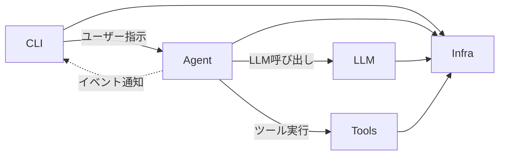

# 技術仕様書 (Architecture Design Document)

## テクノロジースタック

### 言語・ランタイム

| 技術 | バージョン |
|------|-----------|
| Python | 3.12+ |
| uv | 最新版 |

### フレームワーク・ライブラリ

| 技術 | バージョン | 用途 | 選定理由 |
|------|-----------|------|----------|
| LangGraph | >=1.0 | エージェントステートマシン | 状態遷移ベースのエージェント制御。条件分岐・ループ・サブグラフを宣言的に定義でき、Plan-Execute-Criticループの実装に最適 |
| LangChain Core | >=1.0 | LLM/ツール抽象 | ツール定義の標準化（BaseTool）、メッセージ型の統一。LangGraphの基盤として必須。**v1.0以上を使用すること** |
| langchain-openai | >=1.0 | OpenAI接続 | ChatOpenAIによるOpenAI API統合。ストリーミング・ツール呼び出し対応 |
| langchain-google-genai | >=2.1 | Gemini接続 | ChatGoogleGenerativeAIによるGemini API統合。LangChainエコシステムとの一貫したインターフェース |
| Rich | >=13.0 | CLI表示制御 | Markdownレンダリング、シンタックスハイライト、スピナー、テーブル表示。ターミナルUIの業界標準 |
| prompt_toolkit | >=3.0 | CLI入力制御 | 入力履歴、補完、キーバインド、マルチライン入力。対話型CLIの定番 |
| click | >=8.0 | CLIコマンド定義 | サブコマンド、オプション解析、ヘルプ自動生成。Pythonの標準的CLIフレームワーク |
| pydantic | >=2.0 | データバリデーション | 設定ファイルの型安全な読み込み、ツール入力のバリデーション |
| tomli-w | >=1.0 | TOML書き込み | 設定ファイルの書き込み。tomllib（標準ライブラリ）は読み込み専用のため |

### 開発ツール

| 技術 | バージョン | 用途 | 選定理由 |
|------|-----------|------|----------|
| pytest | >=8.0 | テスト | フィクスチャ、パラメタライズ、豊富なプラグインエコシステム |
| pytest-asyncio | >=0.24 | 非同期テスト | async/awaitテストのサポート。LLM呼び出し・ストリーミングのテストに必須 |
| ruff | >=0.6 | リンター/フォーマッター | Rustベースで高速。lint+formatを1ツールで完結。pyproject.tomlで設定一元管理 |
| mypy | >=1.11 | 型チェック | 静的型検証によるバグの早期発見。LangChainの型定義との整合性確認 |

---

## アーキテクチャパターン

### レイヤードアーキテクチャ

```
┌──────────────────────────────────────────┐
│   CLI レイヤー                            │ ← ユーザー入力・表示・確認フロー
│   (CLIApp, Display, ConfirmationHandler) │
├──────────────────────────────────────────┤
│   エージェントレイヤー                      │ ← 思考ループ・タスク分解・評価
│   (AgentCore, Planner, Executor, Critic) │
├──────────────────────────────────────────┤
│   LLM レイヤー                            │ ← LLMプロバイダ抽象・ルーティング
│   (LLMRouter, OpenAIProvider, Gemini...) │
├──────────────────────────────────────────┤
│   ツールレイヤー                           │ ← 外部システムとのインタラクション
│   (ToolRegistry, FileTools, ShellTools,  │
│    GitTools, SearchTools, TestTools)      │
├──────────────────────────────────────────┤
│   インフラレイヤー                         │ ← 横断的関心事
│   (Config, Logger, ContextManager)       │
└──────────────────────────────────────────┘
```

#### CLI レイヤー
- **責務**: ユーザー入力の受付、ストリーミング表示、確認プロンプト、Markdownレンダリング
- **許可される操作**: エージェントレイヤーの呼び出し、インフラレイヤーの利用
- **禁止される操作**: LLMレイヤー・ツールレイヤーへの直接アクセス

#### エージェントレイヤー
- **責務**: LangGraphステートマシンによる思考ループの制御、タスク分解、結果評価
- **許可される操作**: LLMレイヤー・ツールレイヤー・インフラレイヤーの呼び出し
- **禁止される操作**: CLIレイヤーへの直接依存（イベントを通じて間接的に通知）

#### LLM レイヤー
- **責務**: LLMプロバイダの抽象化、フォールバック制御、リトライ、トークン追跡
- **許可される操作**: 外部LLM APIの呼び出し
- **禁止される操作**: ツールレイヤー・エージェントレイヤーへの依存

#### ツールレイヤー
- **責務**: ファイル操作、シェル実行、Git操作等の外部システムとのインタラクション
- **許可される操作**: ファイルシステム、シェル、Gitコマンドへのアクセス
- **禁止される操作**: LLMレイヤー・エージェントレイヤーへの依存

#### インフラレイヤー
- **責務**: 設定管理、ログ出力、コンテキスト管理（横断的関心事）
- **許可される操作**: ファイルシステムへのアクセス（設定・ログの読み書き）
- **禁止される操作**: 他レイヤーのビジネスロジックへの依存

### レイヤー間通信



エージェントレイヤーからCLIレイヤーへの通知は、イベント（`AgentEvent`）を介して行い、直接依存を避ける:

```python
from typing import Literal
from dataclasses import dataclass

EventType = Literal[
    "stream_token",       # LLMのストリーミングトークン
    "tool_start",         # ツール実行開始
    "tool_end",           # ツール実行完了
    "confirm_request",    # ユーザー確認要求
    "plan_generated",     # 計画生成完了
    "step_completed",     # ステップ完了
    "agent_completed",    # エージェント完了
    "agent_failed",       # エージェント失敗
]

@dataclass
class AgentEvent:
    type: EventType
    data: dict[str, Any]
```

---

## データ永続化戦略

### ストレージ方式

| データ種別 | ストレージ | フォーマット | 理由 |
|-----------|----------|-------------|------|
| アプリケーション設定 | ファイル（`~/.myagent/config.toml`） | TOML | 人間が読み書きしやすい。Python標準ライブラリ（tomllib）で読込可能 |
| セッションログ | ファイル（`~/.myagent/logs/`） | JSON | 構造化データとして解析しやすい。1セッション1ファイル |
| セッション状態 | ファイル（`~/.myagent/sessions/`） | JSON | セッション再開用。将来拡張（P2） |

### バックアップ戦略

- **対象**: 設定ファイル（config.toml）
- **頻度**: 設定変更時に自動バックアップ
- **保存先**: `~/.myagent/config.toml.bak`
- **世代管理**: 直前1世代のみ保持（設定ファイルは軽量のため）
- **復元方法**: `cp ~/.myagent/config.toml.bak ~/.myagent/config.toml`

---

## パフォーマンス要件

### レスポンスタイム

| 操作 | 目標時間 | 測定環境 |
|------|---------|---------|
| CLI起動（対話モード） | 500ms以内 | CPU: 4コア以上、メモリ: 8GB以上 |
| 最初のストリーミングトークン表示 | 1秒以内 | ネットワーク遅延除く（LLM API応答時間依存） |
| ファイル読み込み（1MB以下） | 100ms以内 | SSD環境 |
| glob/grep検索（1000ファイル規模） | 2秒以内 | SSD環境 |
| コンテキスト圧縮処理 | 3秒以内 | LLM API応答時間依存 |

### リソース使用量

| リソース | 上限 | 理由 |
|---------|------|------|
| メモリ | 512MB | 会話履歴・インデックスを保持。大規模プロジェクトでも安定動作 |
| ディスク（ログ） | 100MB | 1セッション約100KB想定。自動ローテーション（1000ファイル超で古いものを削除） |
| ディスク（設定） | 1MB | config.toml + バックアップ |

---

## セキュリティアーキテクチャ

### データ保護

- **APIキー管理**:
  - 環境変数（`OPENAI_API_KEY`, `GOOGLE_API_KEY`）から読み込み
  - `.env` ファイルからの読み込みもサポート（python-dotenv不使用、手動パース）
  - ログ出力時はAPIキーを `***` でマスキング
  - 設定ファイルにAPIキーを保存しない

- **ファイルパーミッション**:
  - `~/.myagent/config.toml`: 600（所有者のみ読み書き）
  - `~/.myagent/logs/`: 700（所有者のみアクセス）

- **機密ファイル検知**:
  - 以下のパターンに一致するファイルの読み取り時に警告表示:
    - `.env`, `.env.*`
    - `*credentials*`, `*secret*`
    - `*.pem`, `*.key`, `*.p12`
    - `id_rsa`, `id_ed25519`

### 入力検証

- **コマンド実行の安全性**:
  ```python
  BLOCKED_PATTERNS = [
      r"rm\s+-rf\s+/",      # ルート削除
      r"mkfs\.",             # ディスクフォーマット
      r"\bdd\b.*of=/dev/",   # デバイス直接書き込み
      r":(){ :|:& };:",     # フォーク爆弾
  ]
  ```
  - ブロックリストは正規表現で柔軟に定義
  - マッチした場合は実行をブロックし、ユーザーに通知

- **ファイルアクセス制限**:
  ```python
  def is_within_project(path: str, project_root: str) -> bool:
      """symlink解決後にプロジェクトルート内か判定"""
      real_path = os.path.realpath(path)
      real_root = os.path.realpath(project_root)
      return real_path.startswith(real_root + os.sep) or real_path == real_root
  ```

- **エラーハンドリング**: スタックトレースにAPIキーやファイル内容が含まれないよう、例外メッセージをサニタイズ

---

## スケーラビリティ設計

### データ増加への対応

- **想定データ量**: 会話履歴1セッションあたり最大100メッセージ、ログファイル最大1000セッション
- **パフォーマンス劣化対策**: コンテキスト圧縮によりトークン消費を抑制。ログの自動ローテーション
- **アーカイブ戦略**: 1000セッションを超えたログは古いものから自動削除

### 機能拡張性

- **ツール追加**: LangChain `BaseTool` を継承したクラスを作成し、`ToolRegistry.register()` で登録するだけで追加可能
  ```python
  from langchain_core.tools import BaseTool

  class MyCustomTool(BaseTool):
      name: str = "my_custom_tool"
      description: str = "カスタムツールの説明"

      def _run(self, input: str) -> str:
          # ツール実装
          ...
  ```

- **LLMプロバイダ追加**: `LLMRouter` にプロバイダを追加登録するだけで対応可能。LangChainのChatModel抽象に準拠していれば任意のプロバイダを追加できる

- **設定のカスタマイズ**: config.tomlに新セクションを追加することで、新機能の設定を拡張可能

---

## テスト戦略

### ユニットテスト
- **フレームワーク**: pytest
- **対象**: 各コンポーネントの個別ロジック（Planner, Critic, LLMRouter, ContextManager, 各Tool, 設定パーサー）
- **カバレッジ目標**: 80%以上
- **LLMモック**: LLM呼び出しはモックし、決定論的なテストを実現

### 統合テスト
- **方法**: LLMをモックした状態で、Agent Core → ToolRegistry → 各Tool の一連のフローをテスト
- **対象**: Plan-Execute-Criticループの状態遷移、フォールバックロジック、確認フロー

### E2Eテスト
- **ツール**: pytest + subprocess（CLIをプロセスとして起動）
- **シナリオ**:
  - 対話モードでの単純なファイル操作
  - ワンショットでのコード修正
  - 設定変更の反映確認
- **注意**: 実際のLLM APIを使用するため、CI環境ではスキップ可能にする（`@pytest.mark.e2e`）

---

## 技術的制約

### 環境要件
- **OS**: Linux, macOS, Windows（WSL推奨）
- **Python**: 3.12以上
- **最小メモリ**: 512MB
- **必要ディスク容量**: 100MB（アプリケーション + ログ）
- **ネットワーク**: LLM API呼び出しにインターネット接続が必要

### パフォーマンス制約
- LLM応答速度は外部APIに依存し、制御不可能。ストリーミングで体感速度を改善する
- 大規模プロジェクト（10,000ファイル超）でのglob/grep検索は数秒〜十数秒かかる可能性がある

### セキュリティ制約
- シェルコマンド実行はサンドボックスではなくプロセス直接実行。ブロックリストと確認フローで安全性を担保する
- APIキーはユーザー環境に平文で保存される（OS標準のキーチェーン統合は将来拡張）

---

## 依存関係管理

| ライブラリ | 用途 | バージョン管理方針 |
|-----------|------|-------------------|
| langgraph | エージェントステートマシン | `>=1.0` v1.0以上を使用 |
| langchain-core | LLM/ツール抽象 | `>=1.0` v1.0以上を使用 |
| langchain-openai | OpenAI接続 | `>=1.0` langchain-coreと同期 |
| langchain-google-genai | Gemini接続 | `>=2.1` langchain-coreと同期 |
| rich | CLI表示 | `>=13.0` 安定版のため範囲指定 |
| prompt_toolkit | CLI入力 | `>=3.0` 安定版のため範囲指定 |
| click | CLIコマンド定義 | `>=8.0` 安定版のため範囲指定 |
| pydantic | データバリデーション | `>=2.0` v2系を使用 |
| tomli-w | TOML書き込み | `>=1.0` 安定版のため範囲指定 |
| pytest | テスト | `>=8.0`（dev依存） |
| pytest-asyncio | 非同期テスト | `>=0.24`（dev依存） |
| ruff | リンター/フォーマッター | `>=0.6`（dev依存） |
| mypy | 型チェック | `>=1.11`（dev依存） |

**バージョン管理方針**:
- LangChain関連: `>=` で範囲指定。活発に開発中のため最新に追従し、破壊的変更はuv.lockで管理
- 安定ライブラリ（Rich, click等）: `>=` でメジャーバージョンを固定、マイナーは自動更新
- 全依存関係: `uv.lock` で再現可能なビルドを保証
