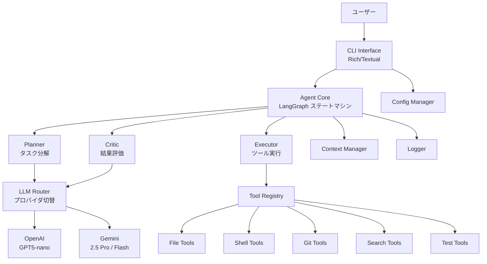
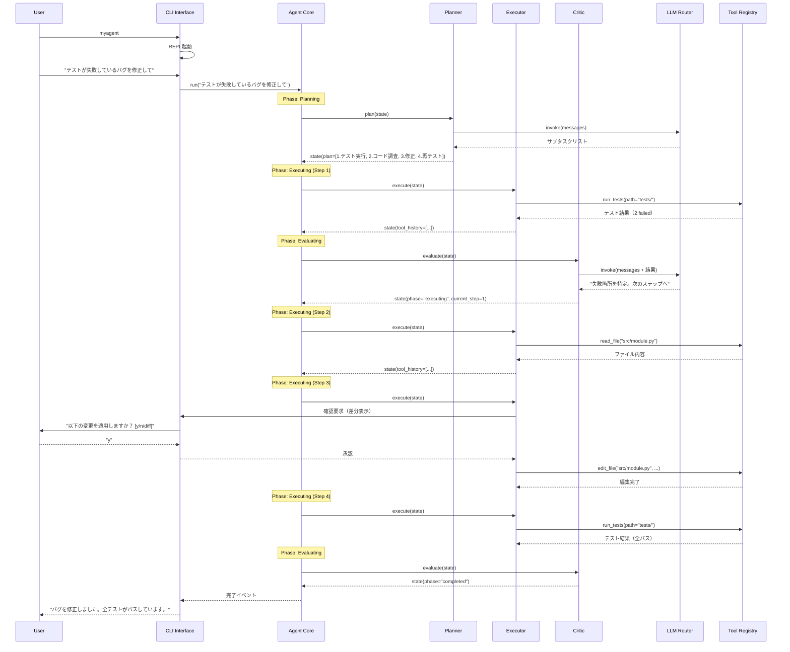
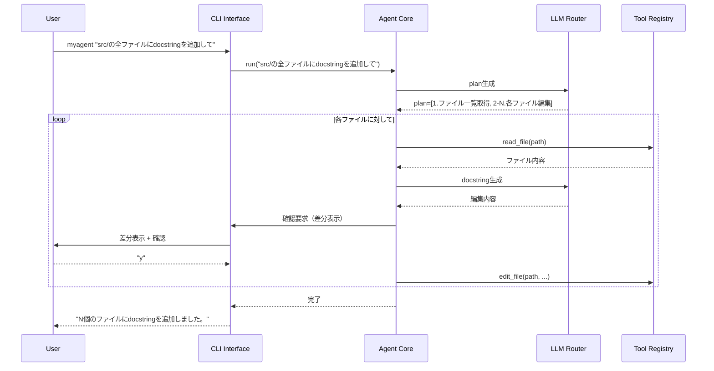
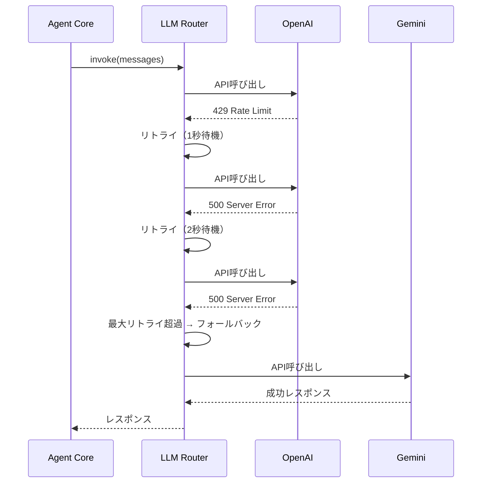
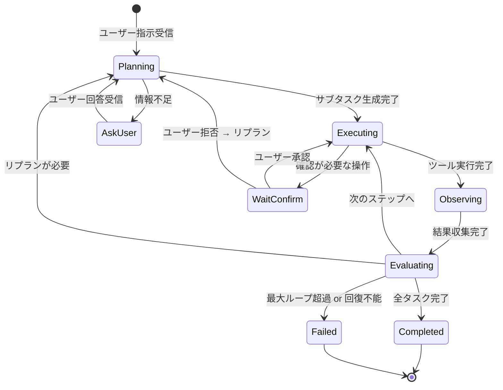

# 機能設計書 (Functional Design Document)

## システム構成図



## 技術スタック

| 分類 | 技術 | 選定理由 |
|------|------|----------|
| 言語 | Python 3.12+ | 型ヒント充実、LangChainエコシステムとの親和性 |
| エージェントフレームワーク | LangGraph (>=1.0) | 状態遷移ベースのエージェント制御、条件分岐・ループの明示的定義 |
| LLMインテグレーション | LangChain (>=1.0) | ツール抽象、プロバイダ統一インターフェース。v1.0以上を使用 |
| LLMプロバイダ | OpenAI (GPT5-nano) / Gemini (2.5 Pro, 2.5 Flash) | マルチプロバイダによる障害耐性・コスト最適化 |
| CLI表示 | Rich | Markdownレンダリング、スピナー、テーブル表示 |
| CLI入力 | prompt_toolkit | 入力履歴、補完、キーバインド |
| 設定管理 | tomllib / tomli-w | TOML形式の設定ファイル読み書き |
| パッケージ管理 | uv | 高速な依存解決 |
| テスト | pytest | フィクスチャ、パラメタライズ |
| リンター | ruff | 高速なlint/format |
| 型チェック | mypy | 静的型検証 |

---

## データモデル定義

### エンティティ: AgentState（エージェント状態）

```python
from __future__ import annotations

from dataclasses import dataclass, field
from datetime import datetime
from enum import Enum
from typing import Any, Literal

AgentPhase = Literal["planning", "executing", "observing", "evaluating", "completed", "failed"]


@dataclass
class SubTask:
    description: str            # サブタスクの説明
    status: Literal["pending", "in_progress", "completed", "failed"] = "pending"
    result: str | None = None   # 実行結果の要約


@dataclass
class ToolCall:
    tool_name: str              # 呼び出したツール名
    input_data: dict[str, Any]  # ツールへの入力
    output_data: str | None = None  # ツールからの出力
    error: str | None = None    # エラー情報
    duration_ms: int = 0        # 実行時間（ミリ秒）
    timestamp: datetime = field(default_factory=datetime.now)


@dataclass
class AgentState:
    """LangGraphのステートマシンで管理されるエージェント状態"""
    messages: list[dict[str, str]]          # 会話履歴（role, content）
    phase: AgentPhase = "planning"          # 現在のフェーズ
    plan: list[SubTask] = field(default_factory=list)  # サブタスクリスト
    current_step: int = 0                   # 現在実行中のステップ番号
    tool_history: list[ToolCall] = field(default_factory=list)  # ツール呼び出し履歴
    iteration_count: int = 0                # ループ回数
    max_iterations: int = 25                # 最大ループ回数
    error_count: int = 0                    # 連続エラー回数
    total_tokens_used: int = 0              # 累計トークン使用量
```

### エンティティ: LLMConfig（LLM設定）

```python
@dataclass
class LLMProviderConfig:
    provider: Literal["openai", "gemini"]  # プロバイダ名
    model: str                              # モデル名（例: "gpt5-nano"）
    api_key_env: str                        # APIキーの環境変数名
    temperature: float = 0.0                # 生成温度
    max_tokens: int = 8192                  # 最大トークン数


@dataclass
class LLMConfig:
    primary: LLMProviderConfig              # メインプロバイダ
    fallback: LLMProviderConfig             # フォールバックプロバイダ
    max_retries: int = 3                    # 最大リトライ回数
    retry_base_delay: float = 1.0           # リトライ基本待機時間（秒）
```

### エンティティ: AppConfig（アプリケーション設定）

```python
@dataclass
class AppConfig:
    llm: LLMConfig                                          # LLM設定
    max_iterations: int = 25                                # 最大イテレーション
    confirmation_level: Literal["strict", "normal", "autonomous"] = "normal"
    shell_timeout: int = 120                                # シェルタイムアウト（秒）
    blocked_commands: list[str] = field(default_factory=lambda: [
        "rm -rf /", "mkfs", "dd",
    ])
    log_level: Literal["DEBUG", "INFO", "WARNING", "ERROR"] = "INFO"
    log_directory: str = "~/.myagent/logs"
```

---

## コンポーネント設計

### CLI Interface

**責務**:
- ユーザー入力の受付（対話モード / ワンショット）
- LLM応答のストリーミング表示
- Markdownレンダリング
- ツール実行中のスピナー表示
- ユーザー確認プロンプトの表示

**インターフェース**:
```python
class CLIApp:
    def run_interactive(self) -> None:
        """対話モード（REPL）を起動する"""
        ...

    def run_oneshot(self, instruction: str) -> None:
        """ワンショットで指示を実行する"""
        ...

    def stream_output(self, token: str) -> None:
        """トークンをストリーミング表示する"""
        ...

    def show_spinner(self, message: str) -> contextlib.AbstractContextManager:
        """スピナーを表示するコンテキストマネージャ"""
        ...

    def ask_confirmation(self, message: str, diff: str | None = None) -> bool:
        """ユーザーに確認を求める。diffがあれば差分を表示"""
        ...

    def render_markdown(self, content: str) -> None:
        """Markdownをレンダリングして表示する"""
        ...
```

**依存関係**:
- Rich（表示制御）
- prompt_toolkit（入力制御）
- AgentCore（エージェント実行）

---

### Agent Core（LangGraph ステートマシン）

**責務**:
- Plan-Execute-Critic ループの状態遷移制御
- サブタスクの管理と進捗追跡
- 最大ループ回数の制御・無限ループ検知

**インターフェース**:
```python
class AgentCore:
    def __init__(self, llm_router: LLMRouter, tool_registry: ToolRegistry,
                 context_manager: ContextManager, config: AppConfig) -> None: ...

    async def run(self, user_instruction: str) -> AsyncIterator[AgentEvent]:
        """ユーザー指示を受けてエージェントループを実行する。
        各ステップのイベントをストリーミングで返す。"""
        ...

    def build_graph(self) -> StateGraph:
        """LangGraphのステートマシンを構築する"""
        ...
```

**依存関係**:
- LangGraph（StateGraph）
- LLMRouter
- ToolRegistry
- ContextManager

---

### Planner

**責務**:
- ユーザーの指示をサブタスクに分解
- 実行順序の決定
- 不足情報がある場合にユーザーへの質問を生成

**インターフェース**:
```python
class Planner:
    def plan(self, state: AgentState) -> AgentState:
        """現在の状態からサブタスクリストを生成する"""
        ...

    def replan(self, state: AgentState) -> AgentState:
        """失敗したタスクを考慮してリプランする"""
        ...
```

---

### Executor

**責務**:
- 計画に従いツールを呼び出す
- ツール実行結果の収集
- 確認フローの制御（確認レベルに応じた承認取得）

**インターフェース**:
```python
class Executor:
    def execute(self, state: AgentState) -> AgentState:
        """現在のサブタスクに対応するツールを実行する"""
        ...

    def should_confirm(self, tool_name: str, tool_input: dict) -> bool:
        """確認が必要な操作かを判定する"""
        ...
```

---

### Critic

**責務**:
- ツール実行結果の評価
- 成功/失敗/再試行の判断
- リプラン要否の決定

**インターフェース**:
```python
class Critic:
    def evaluate(self, state: AgentState) -> AgentState:
        """実行結果を評価し、次のアクション（完了/リトライ/リプラン）を決定する"""
        ...

    def detect_loop(self, state: AgentState) -> bool:
        """同一操作の繰り返しを検知する"""
        ...
```

---

### LLM Router

**責務**:
- OpenAI / Gemini プロバイダの統一インターフェース提供
- フォールバック制御
- リトライ（指数バックオフ）
- トークン使用量の追跡

**インターフェース**:
```python
class LLMRouter:
    def __init__(self, config: LLMConfig) -> None: ...

    async def invoke(self, messages: list[dict], tools: list[dict] | None = None) -> LLMResponse:
        """LLMを呼び出す。失敗時はフォールバックプロバイダに切替"""
        ...

    async def stream(self, messages: list[dict], tools: list[dict] | None = None) -> AsyncIterator[str]:
        """ストリーミングでLLMを呼び出す"""
        ...

    def get_usage(self) -> TokenUsage:
        """累計トークン使用量を返す"""
        ...
```

**依存関係**:
- langchain-openai（ChatOpenAI）
- langchain-google-genai（ChatGoogleGenerativeAI）

---

### Tool Registry

**責務**:
- ツールの登録・管理
- ツール一覧のJSON Schema生成（LLMへの提供用）
- ツール名による実行ディスパッチ

**インターフェース**:
```python
class ToolRegistry:
    def register(self, tool: BaseTool) -> None:
        """ツールを登録する"""
        ...

    def get_tool(self, name: str) -> BaseTool:
        """名前でツールを取得する"""
        ...

    def get_all_schemas(self) -> list[dict]:
        """全ツールのJSON Schemaを返す"""
        ...

    def execute(self, name: str, input_data: dict) -> str:
        """指定ツールを実行する"""
        ...
```

**依存関係**:
- LangChain BaseTool

---

### Context Manager

**責務**:
- 会話履歴のトークン数追跡
- コンテキストウィンドウの圧縮（古い履歴の要約）
- ツール出力のトランケーション
- プロジェクトインデックスの管理

**インターフェース**:
```python
class ContextManager:
    def add_message(self, role: str, content: str) -> None:
        """メッセージを追加し、トークン数を更新する"""
        ...

    def get_messages(self) -> list[dict[str, str]]:
        """現在の会話履歴を返す（必要に応じて圧縮済み）"""
        ...

    def compress_if_needed(self) -> None:
        """トークン上限の80%を超えていたら古い履歴を要約・圧縮する"""
        ...

    def truncate_output(self, output: str, max_lines: int = 200) -> str:
        """長いツール出力をトランケーションする"""
        ...

    def build_project_index(self, root_dir: str) -> None:
        """プロジェクトのファイルツリーをインデックス化する"""
        ...
```

---

## ユースケース図

### UC1: 対話モードでのバグ修正



**フロー説明**:
1. ユーザーが自然言語でバグ修正を指示
2. Plannerがタスクを4ステップに分解（テスト実行→調査→修正→再テスト）
3. Executorが各ステップのツールを順次実行
4. ファイル編集時にユーザー確認フローを経由
5. Criticが各ステップの結果を評価し、次のアクションを決定
6. 全テストパスで完了

---

### UC2: ワンショット実行



---

### UC3: LLMフォールバック



---

## 状態遷移図

### エージェントループの状態遷移



---

## ツール設計

### File Tools

| ツール名 | 入力 | 出力 | 説明 |
|----------|------|------|------|
| `read_file` | `path: str, start_line: int?, end_line: int?` | ファイル内容（行番号付き） | ファイル読み込み |
| `write_file` | `path: str, content: str` | 成功/失敗メッセージ | 新規ファイル作成 |
| `edit_file` | `path: str, old_string: str, new_string: str` | 成功/失敗メッセージ | 既存ファイルの部分編集 |
| `list_directory` | `path: str` | ファイル/ディレクトリ一覧 | ディレクトリ内容表示 |
| `glob_search` | `pattern: str, path: str?` | マッチしたファイルパス一覧 | パターンによるファイル検索 |
| `grep_search` | `pattern: str, path: str?, glob: str?` | マッチした行（ファイル名・行番号付き） | 正規表現による内容検索 |

### Shell Tools

| ツール名 | 入力 | 出力 | 説明 |
|----------|------|------|------|
| `run_command` | `command: str, timeout: int?` | stdout, stderr, return_code | シェルコマンド実行 |

**安全性チェック**:
```python
def is_blocked_command(command: str, blocked_list: list[str]) -> bool:
    """コマンドがブロックリストに該当するか判定"""
    normalized = command.strip().lower()
    return any(blocked in normalized for blocked in blocked_list)
```

### Git Tools

| ツール名 | 入力 | 出力 | 説明 |
|----------|------|------|------|
| `git_status` | なし | status出力 | リポジトリ状態 |
| `git_diff` | `staged: bool?` | diff出力 | 変更差分 |
| `git_log` | `count: int?` | log出力 | コミット履歴 |
| `git_commit` | `message: str, files: list[str]?` | 成功/失敗メッセージ | コミット作成 |
| `git_branch` | `name: str?, action: str?` | ブランチ情報 | ブランチ操作 |
| `git_checkout` | `target: str` | 成功/失敗メッセージ | ブランチ切替 |

### Test Tools

| ツール名 | 入力 | 出力 | 説明 |
|----------|------|------|------|
| `run_tests` | `path: str?, function: str?` | テスト結果（構造化） | pytest実行 |

---

## CLI表示設計

### ストリーミング出力

LLMの応答はトークン単位でリアルタイム表示する。Richの `Live` または `Console` を使用。

### カラーコーディング

| 要素 | 色 | 用途 |
|------|------|------|
| エージェント応答 | 白 | 通常テキスト |
| ツール名 | シアン | ツール実行表示 |
| 成功メッセージ | 緑 | 操作完了 |
| 警告 | 黄 | 確認要求・注意 |
| エラー | 赤 | エラーメッセージ |
| コードブロック | シンタックスハイライト | コード表示 |

### 確認プロンプト表示

```
⚠ ファイルを編集します: src/module.py

  --- src/module.py (変更前)
  +++ src/module.py (変更後)
  @@ -10,3 +10,5 @@
   def calculate():
  -    return x + y
  +    if x is None or y is None:
  +        raise ValueError("x and y must not be None")
  +    return x + y

適用しますか？ [y]es / [n]o / [d]iff(全体):
```

---

## ファイル構造

### 設定・データ保存

```
~/.myagent/
├── config.toml          # アプリケーション設定
├── logs/                # エージェントログ
│   └── 2026-03-20_143022.json  # セッション単位のログ
└── sessions/            # セッション状態（将来拡張）
```

### config.toml の例

```toml
[llm]
default_provider = "openai"
default_model = "gpt5-nano"
fallback_provider = "gemini"
fallback_model = "gemini-2.5-pro"
temperature = 0.0
max_tokens = 8192

[agent]
max_iterations = 25
confirmation_level = "normal"

[shell]
timeout = 120
blocked_commands = ["rm -rf /", "mkfs", "dd"]

[logging]
level = "INFO"
directory = "~/.myagent/logs"
```

### ログファイル形式

```json
{
  "session_id": "uuid",
  "started_at": "2026-03-20T14:30:22Z",
  "instruction": "テストが失敗しているバグを修正して",
  "model_used": "openai/gpt5-nano",
  "iterations": 6,
  "tool_calls": [
    {
      "tool": "run_tests",
      "input": {"path": "tests/"},
      "output": "2 failed, 5 passed",
      "duration_ms": 3200,
      "timestamp": "2026-03-20T14:30:25Z"
    }
  ],
  "tokens": {"prompt": 12500, "completion": 3200, "total": 15700},
  "result": "completed"
}
```

---

## エラーハンドリング

### エラーの分類

| エラー種別 | 処理 | ユーザーへの表示 |
|-----------|------|-----------------|
| LLM API 429 (Rate Limit) | 指数バックオフリトライ（1s, 2s, 4s） | "APIレート制限に達しました。リトライしています..." |
| LLM API 500 (Server Error) | リトライ → フォールバックプロバイダ | "OpenAI APIエラー。Geminiに切り替えます..." |
| LLM API 認証エラー | 即座に停止 | "APIキーが無効です。myagent config で設定を確認してください" |
| ツール実行エラー | エラー内容をLLMに渡してリプラン | "コマンド実行でエラーが発生しました。別のアプローチを試みます..." |
| 危険コマンド検知 | 実行をブロック、ユーザーに通知 | "危険なコマンドを検知しました: [command]。実行をブロックしました" |
| 最大ループ超過 | 強制終了、現在の状態を表示 | "最大イテレーション数(25)に達しました。現在の状態を確認してください" |
| 無限ループ検知 | 強制終了、原因を表示 | "同一操作の繰り返しを検知しました。処理を中断します" |
| ファイルアクセス制限 | 操作をブロック | "プロジェクトディレクトリ外へのアクセスは制限されています" |
| パース失敗 | LLMに再生成を要求（最大2回） | （内部リトライのためユーザーには非表示） |

---

## セキュリティ考慮事項

- **コマンド実行制限**: ブロックリストによる危険コマンド検知、プロジェクトルート外での実行禁止
- **ファイルアクセス制限**: プロジェクトディレクトリ外への書き込み禁止。`os.path.realpath` で symlink を解決して判定
- **APIキー保護**: 環境変数から読み込み、ログ出力時にマスキング
- **機密ファイル警告**: `.env`, `credentials`, `*.pem`, `*.key` 等の読み取り時にユーザーに警告

---

## パフォーマンス最適化

- **ストリーミング応答**: LLMのストリーミングAPIを使用し、最初のトークンを1秒以内に表示
- **独立ツール並列実行**: 依存関係のないツール呼び出しを `asyncio.gather` で並列実行
- **コンテキスト圧縮**: トークン上限の80%到達時に古い会話を要約し、ウィンドウを効率的に使用
- **ツール出力トランケーション**: 200行超のツール出力は先頭・末尾のみ保持

---

## テスト戦略

### ユニットテスト

- Planner: タスク分解ロジックの正確性
- Critic: 成功/失敗/再試行の判断ロジック
- LLMRouter: フォールバック・リトライロジック
- ContextManager: トークン計算・圧縮ロジック
- 各Tool: 入出力の正確性、エラーハンドリング
- is_blocked_command: 危険コマンド検知の網羅性

### 統合テスト

- Agent Core: Plan-Execute-Critic ループの一連のフロー（LLMはモック）
- CLI → Agent → Tools の結合動作
- 設定ファイルの読み込み → 各コンポーネントへの反映

### E2Eテスト

- 対話モードでのバグ修正シナリオ（実際のLLM APIを使用）
- ワンショット実行シナリオ
- フォールバックシナリオ（プライマリプロバイダを意図的に無効化）
- 確認フロー（strict / normal / autonomous）の動作検証
