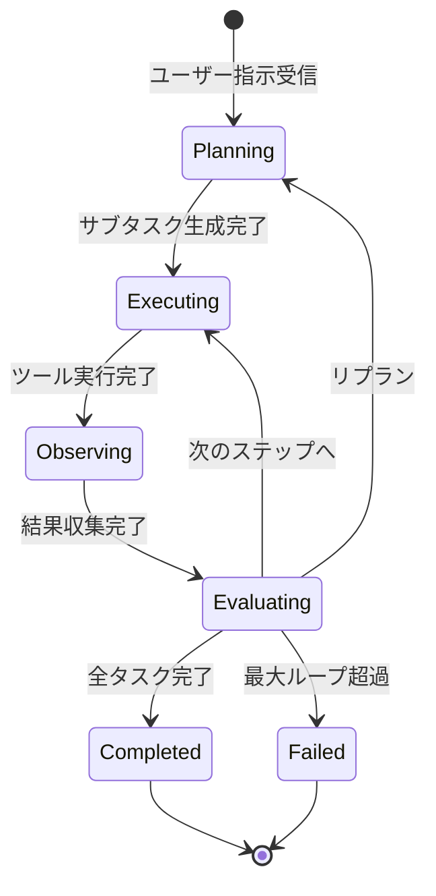

# プロジェクト用語集 (Glossary)

## 概要

このドキュメントは、MyAgentプロジェクト内で使用される用語の定義を管理します。

**更新日**: 2026-03-20

---

## ドメイン用語

### エージェント (Agent)

**定義**: ユーザーの自然言語による指示を受け、ツールを自律的に活用して開発タスクを遂行するAIシステム

**説明**: Plan-Execute-Criticループを通じて、タスク分解・ツール実行・結果評価を繰り返し、複雑な開発作業を段階的に達成する。Claude Codeと同等の機能を自前のLLMプロバイダ上で実現する。

**関連用語**: [思考ループ](#思考ループ-plan-execute-critic)、[サブタスク](#サブタスク-subtask)、[ツール](#ツール-tool)

**使用例**:
- 「エージェントにバグ修正を依頼する」
- 「エージェントが自律的にテストを実行して失敗原因を特定した」

**英語表記**: Agent

---

### 思考ループ (Plan-Execute-Critic)

**定義**: エージェントがタスクを遂行する際の自律的な思考サイクル。計画立案（Plan）→ ツール実行（Execute）→ 結果観察（Observe）→ 結果評価（Evaluate）の4段階を繰り返す

**説明**: LangGraphのステートマシンで状態遷移として実装される。Criticが評価した結果に応じて、完了・再試行・リプランのいずれかに分岐する。最大イテレーション数（デフォルト25回）で無限ループを防止する。

**関連用語**: [Planner](#planner)、[Executor](#executor)、[Critic](#critic)、[エージェント状態](#エージェント状態-agentstate)

**状態遷移図**:


**英語表記**: Plan-Execute-Critic Loop

---

### サブタスク (SubTask)

**定義**: Plannerがユーザーの指示を分解して生成する、個別の実行単位

**説明**: 各サブタスクは説明文・ステータス・実行結果を持つ。Executorが順次実行し、Criticが結果を評価する。

**関連用語**: [Planner](#planner)、[思考ループ](#思考ループ-plan-execute-critic)

**使用例**:
- 「『バグを修正して』という指示が4つのサブタスク（テスト実行→調査→修正→再テスト）に分解された」

**英語表記**: SubTask

---

### ツール (Tool)

**定義**: エージェントが外部システムとインタラクションするための個別の機能。LangChainのBaseTool抽象を実装する

**説明**: ファイル操作、シェル実行、Git操作、コード検索、テスト実行の5カテゴリで構成される。各ツールはJSON Schemaで入出力を定義し、LLMが適切に呼び出せるようにする。

**関連用語**: [ツールレジストリ](#ツールレジストリ-tool-registry)、[Executor](#executor)

**ツール一覧**:
- `read_file`, `write_file`, `edit_file`: ファイル操作
- `glob_search`, `grep_search`: コード検索
- `run_command`: シェル実行
- `git_status`, `git_diff`, `git_commit` 等: Git操作
- `run_tests`: テスト実行

**英語表記**: Tool

---

### 確認フロー (Confirmation Flow)

**定義**: エージェントが重要な操作を実行する前にユーザーの承認を求めるプロセス

**説明**: ファイル書き込み、破壊的Git操作などの前に差分を表示し、ユーザーに `y/n/diff` の選択を求める。確認レベルは3段階で設定可能。

**確認レベル**:
| レベル | 説明 | 確認対象 |
|--------|------|---------|
| `strict` | 全操作で確認 | 読み取り以外の全操作 |
| `normal` | デフォルト | ファイル書き込み、破壊的Git操作 |
| `autonomous` | 確認なし | なし（上級者向け） |

**関連用語**: [Executor](#executor)

**英語表記**: Confirmation Flow

---

### フォールバック (Fallback)

**定義**: プライマリLLMプロバイダが障害を起こした際に、セカンダリプロバイダに自動的に切り替える機構

**説明**: OpenAI → Gemini（またはその逆）のフォールバックを行う。APIエラー時は指数バックオフで最大3回リトライし、それでも失敗した場合にフォールバックが発動する。

**関連用語**: [LLM Router](#llm-router)

**使用例**:
- 「OpenAI APIが429エラーを返したため、Geminiにフォールバックした」

**英語表記**: Fallback

---

## コンポーネント用語

### Planner

**定義**: ユーザーの指示をサブタスクに分解し、実行計画を生成するエージェントコンポーネント

**本プロジェクトでの実装**: `src/myagent/agent/planner.py`

**関連用語**: [思考ループ](#思考ループ-plan-execute-critic)、[サブタスク](#サブタスク-subtask)

---

### Executor

**定義**: 計画に従いツールを呼び出し、結果を収集するエージェントコンポーネント。確認フローの制御も担当する

**本プロジェクトでの実装**: `src/myagent/agent/executor.py`

**関連用語**: [思考ループ](#思考ループ-plan-execute-critic)、[ツール](#ツール-tool)、[確認フロー](#確認フロー-confirmation-flow)

---

### Critic

**定義**: ツール実行結果を評価し、成功・失敗・再試行・リプランの判断を行うエージェントコンポーネント。無限ループの検知も担当する

**本プロジェクトでの実装**: `src/myagent/agent/critic.py`

**関連用語**: [思考ループ](#思考ループ-plan-execute-critic)

---

### LLM Router

**定義**: 複数のLLMプロバイダ（OpenAI / Gemini）の統一インターフェースを提供し、フォールバック・リトライ・トークン追跡を管理するコンポーネント

**本プロジェクトでの実装**: `src/myagent/llm/router.py`

**関連用語**: [フォールバック](#フォールバック-fallback)

---

### ツールレジストリ (Tool Registry)

**定義**: 全ツールの登録・管理・ディスパッチを行うコンポーネント。ツールのJSON Schema一覧をLLMに提供する

**本プロジェクトでの実装**: `src/myagent/tools/registry.py`

**関連用語**: [ツール](#ツール-tool)

---

### Context Manager

**定義**: 会話履歴のトークン数追跡、コンテキスト圧縮、プロジェクトインデックスの管理を行うコンポーネント

**説明**: コンテキストウィンドウの80%に達したら古い会話を要約して圧縮する。プロジェクト初回ロード時にファイルツリーをインデックス化する。

**本プロジェクトでの実装**: `src/myagent/infra/context.py`

**関連用語**: [コンテキスト圧縮](#コンテキスト圧縮-context-compression)

---

## データモデル用語

### エージェント状態 (AgentState)

**定義**: LangGraphのステートマシンで管理される、エージェントの現在の状態を表すデータ構造

**主要フィールド**:
- `messages`: 会話履歴（role, content）
- `phase`: 現在のフェーズ（planning / executing / observing / evaluating / completed / failed）
- `plan`: サブタスクリスト
- `current_step`: 現在実行中のステップ番号
- `tool_history`: ツール呼び出し履歴
- `iteration_count`: ループ回数
- `total_tokens_used`: 累計トークン使用量

**実装箇所**: `src/myagent/agent/state.py`

**関連用語**: [思考ループ](#思考ループ-plan-execute-critic)、[エージェントフェーズ](#エージェントフェーズ-agentphase)

---

### エージェントフェーズ (AgentPhase)

**定義**: エージェントの思考ループにおける現在の状態を示す列挙型

**取りうる値**:

| フェーズ | 意味 | 遷移条件 | 次のフェーズ |
|---------|------|---------|------------|
| `planning` | 計画立案中 | ユーザー指示受信 / リプラン | `executing` |
| `executing` | ツール実行中 | サブタスク生成完了 | `observing` |
| `observing` | 結果観察中 | ツール実行完了 | `evaluating` |
| `evaluating` | 結果評価中 | 結果収集完了 | `completed`, `executing`, `planning`, `failed` |
| `completed` | 全タスク完了 | 最終評価で成功 | - |
| `failed` | 失敗 | 最大ループ超過 / 回復不能エラー | - |

**実装箇所**: `src/myagent/agent/state.py`

---

### エージェントイベント (AgentEvent)

**定義**: エージェントレイヤーからCLIレイヤーへの通知に使用されるイベントオブジェクト。レイヤー間の直接依存を避ける

**イベント種別**:
- `stream_token`: LLMのストリーミングトークン
- `tool_start`: ツール実行開始
- `tool_end`: ツール実行完了
- `confirm_request`: ユーザー確認要求
- `plan_generated`: 計画生成完了
- `step_completed`: ステップ完了
- `agent_completed`: エージェント完了
- `agent_failed`: エージェント失敗

**実装箇所**: `src/myagent/agent/events.py`

---

## 技術用語

### LangGraph

**定義**: LLMアプリケーションの状態遷移を宣言的に定義するためのフレームワーク。LangChainエコシステムの一部

**本プロジェクトでの用途**: エージェントのPlan-Execute-Criticループをステートマシンとして実装。条件分岐、ループ、サブグラフを管理する

**バージョン**: >=1.0

**関連ドキュメント**: [アーキテクチャ設計書](./architecture.md)

---

### LangChain

**定義**: LLMアプリケーション構築のためのPythonフレームワーク。ツール抽象（BaseTool）、メッセージ型、プロバイダ統合を提供する

**本プロジェクトでの用途**: ツール定義の標準化（BaseTool継承）、OpenAI / Geminiプロバイダの統一インターフェース

**バージョン**: langchain-core >=1.0

**関連ドキュメント**: [アーキテクチャ設計書](./architecture.md)

---

### Rich

**定義**: Pythonのターミナル向けリッチテキスト表示ライブラリ。Markdownレンダリング、シンタックスハイライト、テーブル、スピナーを提供する

**本プロジェクトでの用途**: CLIの表示制御全般（ストリーミング出力、差分表示、プログレス表示）

**バージョン**: >=13.0

---

### prompt_toolkit

**定義**: Pythonの対話型コマンドライン入力ライブラリ。入力履歴、補完、キーバインド、マルチライン入力を提供する

**本プロジェクトでの用途**: REPL（対話モード）の入力制御

**バージョン**: >=3.0

---

## 略語・頭字語

### CLI

**正式名称**: Command Line Interface

**意味**: コマンドラインから操作するインターフェース

**本プロジェクトでの使用**: MyAgentのメインインターフェース。`myagent` コマンドで対話モードまたはワンショット実行を行う

**実装**: `src/myagent/cli/`

---

### REPL

**正式名称**: Read-Eval-Print Loop

**意味**: 入力の読み取り→評価→結果表示を繰り返す対話型インターフェース

**本プロジェクトでの使用**: `myagent` コマンド（引数なし）で起動する対話モード

---

### LLM

**正式名称**: Large Language Model

**意味**: 大規模言語モデル。自然言語を理解・生成するAIモデル

**本プロジェクトでの使用**: OpenAI GPT5-nano / Google Gemini 2.5 Pro, 2.5 Flash をエージェントの推論エンジンとして使用

---

### MCP

**正式名称**: Model Context Protocol

**意味**: LLMと外部ツール・データソースを接続するためのオープンプロトコル

**本プロジェクトでの使用**: 将来拡張（P2）として検討中。エージェントの能力を外部ツールで拡張する

---

## アーキテクチャ用語

### レイヤードアーキテクチャ (Layered Architecture)

**定義**: システムを役割ごとに複数の層に分割し、上位層から下位層への一方向の依存関係を持たせる設計パターン

**本プロジェクトでの適用**: 5層構造を採用

```
CLIレイヤー (cli/)
    ↓
エージェントレイヤー (agent/)
    ↓              ↓
LLMレイヤー (llm/)  ツールレイヤー (tools/)

インフラレイヤー (infra/) ← 全レイヤーから依存可能
```

**メリット**: 関心の分離、テスト容易性、変更影響の限定

**関連ドキュメント**: [アーキテクチャ設計書](./architecture.md)、[リポジトリ構造定義書](./repository-structure.md)

---

### コンテキスト圧縮 (Context Compression)

**定義**: 会話履歴のトークン数がコンテキストウィンドウの上限に近づいた際に、古い履歴をLLMで要約して短縮する手法

**本プロジェクトでの適用**: コンテキストウィンドウの80%到達時に自動実行。ツール出力が200行を超える場合はトランケーションも行う

**関連用語**: [Context Manager](#context-manager)

---

### イベント駆動通知 (Event-Driven Notification)

**定義**: エージェントレイヤーからCLIレイヤーへの通知を、直接の関数呼び出しではなくイベントオブジェクト（AgentEvent）を介して行う設計パターン

**本プロジェクトでの適用**: エージェントからCLIへの逆方向依存を避けるために採用。`async for event in agent.run(instruction)` の形式でイベントを受け取る

**関連用語**: [エージェントイベント](#エージェントイベント-agentevent)

---

## エラー・例外

### MyAgentError

**クラス名**: `MyAgentError`

**継承元**: `Exception`

**発生条件**: MyAgent固有の全エラーの基底クラス。直接使用しない

**実装箇所**: 開発ガイドラインで定義

---

### LLMError

**クラス名**: `LLMError`

**継承元**: `MyAgentError`

**発生条件**: 全LLMプロバイダでAPI呼び出しが失敗した場合（リトライ・フォールバック後も回復不可）

**対処方法**:
- ユーザー: APIキーの設定を確認、ネットワーク接続を確認
- 開発者: エラーログでプロバイダ別の失敗原因を確認

---

### ToolExecutionError

**クラス名**: `ToolExecutionError`

**継承元**: `MyAgentError`

**発生条件**: ツール実行が失敗した場合（ファイルが存在しない、コマンドタイムアウト等）

**対処方法**:
- ユーザー: エラーメッセージを確認し、エージェントに修正を依頼
- 開発者: ツールの入力バリデーションとエラーメッセージを改善

---

### SecurityError

**クラス名**: `SecurityError`

**継承元**: `MyAgentError`

**発生条件**: セキュリティ制約に違反した場合（危険コマンド実行、プロジェクト外へのファイルアクセス等）

**対処方法**:
- ユーザー: ブロックされた操作の代替手段を検討
- 開発者: ブロックリストの妥当性を確認

---

### ConfigError

**クラス名**: `ConfigError`

**継承元**: `MyAgentError`

**発生条件**: 設定ファイルの読み込み・検証に失敗した場合（config.tomlの構文エラー、必須項目の欠落等）

**対処方法**:
- ユーザー: `myagent config list` で設定を確認、config.tomlを修正
- 開発者: デフォルト値のフォールバックを検討

---

## 索引

### あ行
- [エージェント](#エージェント-agent) - ドメイン用語
- [エージェント状態](#エージェント状態-agentstate) - データモデル用語
- [エージェントイベント](#エージェントイベント-agentevent) - データモデル用語
- [エージェントフェーズ](#エージェントフェーズ-agentphase) - データモデル用語
- [イベント駆動通知](#イベント駆動通知-event-driven-notification) - アーキテクチャ用語

### か行
- [確認フロー](#確認フロー-confirmation-flow) - ドメイン用語
- [コンテキスト圧縮](#コンテキスト圧縮-context-compression) - アーキテクチャ用語

### さ行
- [サブタスク](#サブタスク-subtask) - ドメイン用語
- [思考ループ](#思考ループ-plan-execute-critic) - ドメイン用語

### た行
- [ツール](#ツール-tool) - ドメイン用語
- [ツールレジストリ](#ツールレジストリ-tool-registry) - コンポーネント用語

### は行
- [フォールバック](#フォールバック-fallback) - ドメイン用語

### ら行
- [レイヤードアーキテクチャ](#レイヤードアーキテクチャ-layered-architecture) - アーキテクチャ用語

### A-Z
- [CLI](#cli) - 略語
- [ConfigError](#configerror) - エラー
- [Context Manager](#context-manager) - コンポーネント用語
- [Critic](#critic) - コンポーネント用語
- [Executor](#executor) - コンポーネント用語
- [LangChain](#langchain) - 技術用語
- [LangGraph](#langgraph) - 技術用語
- [LLM](#llm) - 略語
- [LLM Router](#llm-router) - コンポーネント用語
- [LLMError](#llmerror) - エラー
- [MCP](#mcp) - 略語
- [MyAgentError](#myagenterror) - エラー
- [Planner](#planner) - コンポーネント用語
- [prompt_toolkit](#prompt_toolkit) - 技術用語
- [REPL](#repl) - 略語
- [Rich](#rich) - 技術用語
- [SecurityError](#securityerror) - エラー
- [ToolExecutionError](#toolexecutionerror) - エラー
